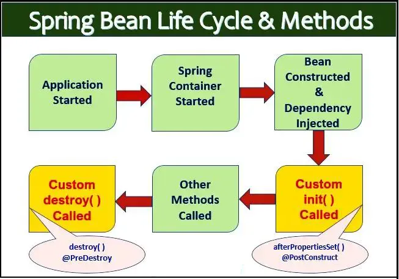

## Spring Framework

-	** What are the key differences between a library and a framework ? **
	-	The main difference is inversion of control ; in a library , your code calls the library code , whereas in a framework , the framework calls your code to provide specific functionality 

-	** What is Inversion of Control ( IoC ) Container ? **
	-	A framework component that manages the lifecycle and configuration of objects by injecting dependencies automatically 

-	** What is Dispatcher servlet ? **
	-	A central controller in Spring MVC that acts as a front controller by intercepting all incoming HTTP requests and routing them to the appropriate handlers for processing 
	-	
	-	[GFG Detailed Blog](https://www.geeksforgeeks.org/java/what-is-dispatcher-servlet-in-spring/)

-	** What is the difference between Dependency Injection and Inversion of Control  ? **
	-	IoC is a broad design principle where a program delegates control to a container or framework , while DI is the specific design pattern used to implement IoC by providing an object ' s dependencies from the outside .

-	** What is a Bean ? **
	-	An object that is instantiated , assembled , and otherwise managed by a Spring IoC container.

-	** What are the different bean scopes and their descriptions ? **
	-	singleton : creates a single shared instance per IoC container .
	-	prototype : creates a new bean instance every time it is requested .
	-	request : creates a single bean instance for the lifecycle of a single HTTP request .
	-	session : creates a single bean instance for the lifecycle of an HTTP session .
	-	application : creates a single bean instance for the lifecycle of a ServletContext .
	-	websocket : creates a single bean instance for the lifecycle of a WebSocket .

-	** What is the Bean lifecycle ? **
	-	The process of instantiation , dependency injection , initialization through callbacks like @PostConstruct , usage , and finally destruction via @PreDestroy managed by the Spring container.
	-	[GFG Detailed Blog](https://www.geeksforgeeks.org/java/bean-life-cycle-in-java-spring/)
	-	[Image Source](https://medium.com/@sendvjs/spring-bean-life-cycle-9363332c335e)

-	** How to manage a Bean ? **
	-	By using the Spring IoC container to handle instantiation , configuration , and destruction through annotations like @Component , @Bean , or XML configuration

-	** What is ApplicationContext ? **
	-	A more advanced variant of the BeanFactory that provides central configuration , event publishing , and AOP features to manage the complete lifecycle of beans .

-	** What is the difference between XML and Annotation configuration ? **
	-	XML configuration keeps configuration separate from source code in external files , whereas Annotation configuration provides a more concise way to define metadata directly on classes and methods using tags like @Component or @Autowired

-	** What is the difference between XML and Bean configuration ? **
	-	XML configuration defines beans and dependencies in a separate external file , while Bean configuration uses Java classes annotated with @Configuration and methods with @Bean to manage objects programmatically

-	** How is Dependency management handled in a pom . xml ? **
	-	By using the section to list required libraries and the section to centralize and consolidate version numbers for multi -	module projects .

-	** What is the use of Spring Profile ? **
	-	It allows for segregating parts of your application configuration and making them only available in certain environments , such as dev , test , or prod .

-	** What is Swagger in Spring Boot ? **
	-	A tool that automatically generates interactive API documentation and testing interfaces for RESTful web services by scanning your controllers and annotations
	-	[YT Tutorial](https://youtu.be/IxKL0N7juMQ)

-	** Why go for Maven over Ant ? **
	-	Maven provides a standardized project structure and automated dependency management through a central repository , whereas Ant requires manual configuration of the build process and library management via scripts

-	** What is the Maven build lifecycle ? **
	-	A clearly defined process for building and distributing a project consisting of three built -	in lifecycles : default ( handles project deployment ) , clean ( handles project cleaning ) , and site ( handles project site documentation ) .

-	** What are the differences between Gradle and Maven ? **
	-	Gradle uses a performance -	oriented build cache and supports incremental builds for faster execution , whereas Maven relies on a more rigid XML structure and executes all build steps sequentially without the same level of optimization

-	** What are the key differences between Java , Kotlin , and Groovy ? **
	-	Java is a statically typed , verbose language that serves as the foundation for the JVM
	-	Kotlin is a modern , statically typed language that reduces boilerplate and ensures null safety
	-	Groovy is a dynamic , script -	friendly language that offers high flexibility and is often used for build tools like Gradle

-	** What are the differences between SLF4J , Log4j , and Logback ? **
	-	SLF4J is an abstraction layer or facade that allows you to plug in any logging framework at deployment time
	-	Log4j is a popular , older logging library that requires direct configuration
	-	Logback is the successor to Log4j , providing faster implementation and native support for the SLF4J interface

-	** What is the difference between Embedded Tomcat and Standalone Tomcat ? **
	-	Embedded Tomcat is bundled directly within the application JAR and starts automatically with the application
	-	Standalone Tomcat is a separate installation on a server where you manually deploy WAR files into its webapps folder

-	** How to change the default embedded Tomcat server in Spring Boot ? **
	-	By excluding the spring -	boot -	starter -	tomcat dependency in the pom . xml or build . gradle file and adding a dependency for an alternative server like Jetty or Undertow

-	** What is the difference between Lombok and Jackson ? **
	-	Lombok is a compile-time library used to reduce Java boilerplate code by automatically generating getters , setters , constructors , and toString methods via annotations .
	-	Jackson is a runtime library used for data binding , specifically for converting ( serializing ) Java objects into JSON format and converting ( deserializing ) JSON strings back into Java objects .
	-	While Lombok helps you write cleaner code inside your IDE , Jackson handles the actual data exchange between your application and external systems like web browsers or other microservices .
	-	```java
			@Data // Lombok: Generates getters, setters, equals, hashCode, and toString
			@NoArgsConstructor // Lombok: Generates a no-args constructor
			public class UserDTO {
				@JsonProperty("user_id") // Jackson: Maps JSON key "user_id" to this field
				private Long id;
				
				private String name;
				
				@JsonIgnore // Jackson: Excludes this field from the JSON output
				private String internalPassword;
			}
		```

-	** What are @Data , @Getter , and @Setter ? **
	-	@Getter and @Setter : Lombok annotations that automatically generate the getter and setter methods for fields at compile time , reducing boilerplate code .
	-	@Data : A shortcut Lombok annotation that bundles @Getter , @Setter , @ToString , @EqualsAndHashCode , and @RequiredArgsConstructor together into a single annotation .\
	-	```java
			@Data // Generates everything: Getters, Setters, toString, equals, and hashCode
			public class User {
				private Long id;
				
				@Getter @Setter // Can also be applied specifically to a single field
				private String name;
			}
		```

---

## JDBC

-	** When do we prefer a relational database ? **
	-	Relational databases are preferred when data follows a fixed schema , requires ACID compliance for transactional integrity , and involves complex relationships requiring joins between multiple tables .

-	** What are the use cases for MySQL , SQL Server , Oracle , and PostgreSQL ? **
	-	MySQL : widely used for web applications , CMS platforms like WordPress , and e -	commerce sites due to its speed and simplicity .
	-	SQL Server : preferred for enterprise applications integrated with the Microsoft ecosystem , offering seamless compatibility with . NET and Azure .
	-	Oracle : used for large -	scale mission -	critical systems in banking and finance that require high scalability , advanced security , and robust analytical tools .
	-	PostgreSQL : chosen for complex data workloads , scientific computing , and applications requiring advanced features like JSONB support and high extensibility

-	** When do we prefer a NoSQL database ? **
	-	NoSQL databases are preferred when dealing with unstructured or semi -	structured data , requiring horizontal scaling to handle massive volumes of traffic , or needing a flexible schema that evolves quickly without downtime .

-	** What are the use cases for MongoDB , Cassandra , Redis , and Neo4j ? **
	-	MongoDB : ideal for content management , real -	time analytics , and mobile apps where data is stored in flexible , JSON -	like documents .
	-	Cassandra : used for high -	availability systems and big data workloads that require massive write throughput across multiple data centers .
	-	Redis : preferred for caching , session management , and real -	time leaderboards due to its ultra -	fast in -	memory data storage .
	-	Neo4j : chosen for social networks , recommendation engines , and fraud detection where the relationships between data points are as important as the data itself .


---

## JPA

-	** What is @Entity and its related annotations ? **
	-	@Entity : specifies that the class is a mapped entity to a database table .
	-	@Table : defines the specific name of the table in the database .
	-	@Id : marks a field as the primary key of the entity .
	-	@GeneratedValue : specifies the strategy for primary key generation ( e.g. , IDENTITY , SEQUENCE ) .
	-	@Column : maps a field to a specific column name and defines constraints like nullable or unique .
	-	@Transient : indicates that a field should not be persisted in the database .
	-	```java
			@Entity
			@Table(name = "users")
			public class User {
				@Id
				@GeneratedValue(strategy = GenerationType.IDENTITY)
				private Long id;

				@Column(name = "user_name", nullable = false)
				private String name;

				@Transient
				private String tempToken;
			}
		```

-	** What is @Table and its related annotations ? **
	-	@Table : specifies the primary table for the annotated entity , allowing you to define the table name , catalog , and schema .
	-	name : used to explicitly set the database table name if it differs from the class name .
	-	uniqueConstraints : defines a set of unique constraints to be included in the generated DDL for the table .
	-	indexes : specifies the indexes for the table , improving query performance on specific columns .
	-	@UniqueConstraint : used within @Table to define a multi -	column unique index .
	-	@Index : used within @Table to define a database index on one or more columns .
	-	```java
			@Entity 
			@Table(
				name = "users" , 
				uniqueConstraints = { @UniqueConstraint(columnNames = "email") } , 
				indexes = { @Index(name = "idx_user_name", columnList = "name") }
			)
			public class User { 
				@Id 
				private Long id ; 
				
				private String name ; 
				
				private String email ; 
			} 
		```

-	** What are DTO and POJO and their related annotations ? **
	-	POJO ( Plain Old Java Object ) : A simple Java object not bound by any special restriction other than those forced by the Java Language Specification , typically used as an internal data model .
	-	DTO ( Data Transfer Object ) : An object that carries data between processes ( e.g. , from a Controller to a Service ) to reduce the number of method calls and hide internal entity structures from the API .
	-	@Data : A Lombok annotation that bundles @ToString , @EqualsAndHashCode , @Getter , @Setter , and @RequiredArgsConstructor together .
	-	@Value : A Lombok annotation used to create immutable DTOs by making all fields private and final .
	-	@Builder : Provides a flexible way to instantiate objects using the builder pattern , which is useful for complex DTOs .
	-	@JsonProperty : A Jackson annotation used to map a Java field to a specific key name in the JSON structure .
	-	```java
		// Example DTO using Lombok and Jackson
		@Data
		@Builder
		public class UserDTO {
			@JsonProperty("user_id")
			private Long id;
			
			private String fullName;
			
			@JsonIgnore
			private String internalSecret;
		}

		```
	-	```java
			// Example POJO
			public class User {
			private String name;
			private int age;

			// Default constructor
			public User() {}

			// Parameterized constructor
			public User(String name, int age) {
				this.name = name;
				this.age = age;
			}

			// Getters and Setters
			public String getName() { return name; }
			public void setName(String name) { this.name = name; }

			public int getAge() { return age; }
			public void setAge(int age) { this.age = age; }
		}

		```


-	** What is Caching in JPA ? **
	-	A performance optimization technique that stores frequently accessed data in memory to reduce the number of expensive database hits .

-	** What are the different levels of caching in JPA ? **
	-	First -	Level Cache ( L1 ) : A mandatory , session -	scoped cache associated with the EntityManager that is always enabled and stores entities within a single transaction .
	-	Second -	Level Cache ( L2 ) : An optional , application -	scoped cache shared across all sessions that requires explicit configuration and a provider like Ehcache or Hazelcast .
	-	Query Cache : A specific cache that stores the results of a query ( typically just entity IDs ) and must be used alongside the L2 cache for maximum efficiency .

-	** What is the difference between Second -	Level Cache ( L2 ) and Query Cache ? **
	-	Second -	Level Cache ( L2 ) stores the actual entity data ( state ) by its primary key across sessions , allowing Hibernate to avoid database hits when loading an entity by its ID .
	-	Query Cache stores only the results of a specific query ( typically a list of IDs ) along with the query parameters , meaning it maps a query string to a set of IDs rather than storing the actual objects .
	-	Query Cache depends on the L2 Cache to be efficient ; once the Query Cache provides the IDs , Hibernate looks up the full entity data in the L2 Cache to avoid a database fetch .
	-	```java
		# Stores entity objects by ID
		spring.jpa.properties.hibernate.cache.use_second_level_cache = true

		# Stores result sets ( IDs ) for specific query strings
		spring.jpa.properties.hibernate.cache.use_query_cache = true

		```

-	** How to enable Second -	Level Caching in Spring Boot ? **
	-	Add a cache provider dependency ( e . g . , hibernate -	ehcache ) to your pom . xml .
	-	Enable the cache in application . properties :
	-	```java
			spring.jpa.properties.hibernate.cache.use_second_level_cache = true
			spring.jpa.properties.hibernate.cache.region.factory_class = org.hibernate.cache.ehcache.EhCacheRegionFactory
			
			// Mark your entity as cacheable using @Cacheable and define a strategy with @Cache .
			
			@Entity
			@Cacheable
			@org.hibernate.annotations.Cache(usage = CacheConcurrencyStrategy.READ_WRITE)
			public class User { ... }
			
		```

-	** What is the Query Cache in JPA / Hibernate ? **
	-	An optional Second-Level Cache feature that stores the results of a specific query ( identified by the query string and its parameters ) as a list of entity identifiers .
	-	It is primarily used to avoid re-executing the same SQL query against the database when the parameters haven't changed , but it must be used in conjunction with the Second-Level Entity Cache to actually retrieve the full entity data without a database hit
	-	```java
		// 1. Enable in application.properties
		// spring.jpa.properties.hibernate.cache.use_query_cache=true

		// 2. Use in Repository
		public interface UserRepository extends JpaRepository<User, Long> {
			@QueryHints(@QueryHint(name = "org.hibernate.cacheable", value = "true"))
			List<User> findByName(String name);
		}
		```

-	** What are the different ways to query in JPA ? **
	-	Query Methods ( Derived Queries ) : by following a naming convention in the repository interface , Spring Data JPA generates the SQL automatically .
	-	JPQL ( Java Persistence Query Language ) : an object -	oriented query language that defines queries based on entity classes and fields instead of database tables .
	-	Native Queries : raw SQL queries that interact directly with the specific database dialect , used for complex or performance -	optimized operations .
	-	Criteria API : a typesafe , programmatic way to build dynamic queries using Java objects , which helps avoid syntax errors at runtime .
	-	Example Data ( Query by Example ) : allows creating queries by providing a partially populated entity object as a template .
	-	```java
			public interface UserRepository extends JpaRepository<User, Long> {
				// 1. Derived Query
				List<User> findByEmail(String email);

				// 2. JPQL
				@Query("SELECT u FROM User u WHERE u.status = :status")
				List<User> findUsersByStatus(String status);

				// 3. Native Query
				@Query(value = "SELECT * FROM users WHERE age > 18", nativeQuery = true)
				List<User> findAdults();
			}
		```
	-	```java
			//	4. Criteria API : a programmatic , typesafe way to build queries using Java objects , ideal for dynamic search filters .
			@Service
			public class UserService {
				@PersistenceContext
				private EntityManager em;

				public List<User> findUsers(String name) {
					CriteriaBuilder cb = em.getCriteriaBuilder();
					CriteriaQuery<User> cq = cb.createQuery(User.class);
					Root<User> user = cq.from(User.class);
					cq.select(user).where(cb.equal(user.get("name"), name));
					return em.createQuery(cq).getResultList();
				}
			}

		```
	-	```java
			//	5. Query by Example ( QBE ) : allows creating queries by providing a partially populated entity object as a template .
			@Service
			public class UserService {
				@Autowired
				private UserRepository userRepository;

				public List<User> findByExample(String name) {
					User userProbe = new User();
					userProbe.setName(name); // Set the criteria
					Example<User> example = Example.of(userProbe);
					return userRepository.findAll(example);
				}
			}

		```

-	** What is a Native Query in JPA ? **
	-	A query written in the specific SQL dialect of the underlying database ( e.g. , MySQL or Oracle ) rather than Java Persistence Query Language ( JPQL ) .
	-	It is used when you need to perform database -	specific operations , use complex joins , or execute performance -	optimized queries that are not supported by the standard JPA abstraction .
	-	```java
		public interface UserRepository extends JpaRepository<User, Long> {
			// nativeQuery = true tells JPA to execute raw SQL
			@Query(value = "SELECT * FROM users WHERE status = 'ACTIVE'", nativeQuery = true)
			List<User> findAllActiveUsers();

			@Modifying
			@Transactional
			@Query(value = "UPDATE users SET last_login = NOW() WHERE id = :id", nativeQuery = true)
			void updateLastLogin(Long id);
		}
		```

-	** What is the purpose of the mappedBy attribute in JPA ? **
	-	It is used in bidirectional relationships to specify the non -	owning ( inverse ) side of the association.
	-	It tells Hibernate that the relationship is already managed by a field in the other entity , preventing the creation of redundant foreign key columns or unnecessary join tables in the database.
	-	The value of mappedBy must match the name of the field in the owning entity class that defines the relationship
	-	```java
			@Entity
			public class Company {
				@Id
				private Long id;

				// Inverse side: mappedBy points to the 'company' field in the Branch class
				@OneToMany(mappedBy = "company", cascade = CascadeType.ALL)
				private List<Branch> branches;
			}

			@Entity
			public class Branch {
				@Id
				private Long id;

				// Owning side: contains the actual foreign key (company_id) in the database
				@ManyToOne
				@JoinColumn(name = "company_id")
				private Company company;
			}

		```

-	** What is the difference between @Transient and volatile ? **
	-	@Transient is a JPA annotation used to indicate that a specific field should not be persisted in the database , meaning it will be ignored by the ORM during save and load operations .
	-	volatile is a Java keyword used in multi -	threading to ensure that a variable ' s value is always read from and written to the main memory , providing visibility of changes across different threads .
	-	```java
		public class User implements Serializable {
			@Id
			private Long id;

			@Transient
			private String sessionToken; // Will not be saved to the database

			private volatile boolean isActive; // Ensures thread-safe visibility in memory
		}

		```

-	** What is the difference between @Ignore and @JsonIgnore ? **
	-	@Ignore ( typically from Lombok or specific testing frameworks like JUnit 4 ) is used to tell a tool to skip generating code for a field or to skip running a specific test method .
	-	@JsonIgnore ( from the Jackson library ) is used to prevent a specific field from being serialized into JSON or deserialized from JSON during API requests and responses .
	-	```java
			public class User {
				private Long id;

				@JsonIgnore
				private String password; // Will be excluded from the JSON response

				@Getter(AccessLevel.NONE)
				private String internalCode; // Lombok will not generate a getter for this
			}
		```

-	** What is @Auditable ? **
	-	In Spring Boot, the term @Auditable typically refers to using the Spring Data JPA auditing features, which automatically track who created or last modified an entity and when these events occurred. This is achieved using several annotations and configuration steps, rather than a single @Auditable annotation provided by the framework itself
	-	Define a Base Auditable Entity Class: Create an abstract class that holds the audit fields and is annotated with @MappedSuperclass and @EntityListeners(AuditingEntityListener.class)
	-	Extend Entities: Make your application entities extend the Auditable base class to inherit the auditing functionality
	-	``` java
			import jakarta.persistence.*;
			import org.springframework.data.annotation.*;
			import org.springframework.data.jpa.domain.support.AuditingEntityListener;
			import java.time.LocalDateTime;

			@MappedSuperclass
			@EntityListeners(AuditingEntityListener.class)
			public abstract class Auditable {
				@CreatedDate
				@Column(name = "created_at", updatable = false)
				private LocalDateTime createdAt;

				@LastModifiedDate
				@Column(name = "updated_at")
				private LocalDateTime updatedAt;

				@CreatedBy
				@Column(name = "created_by", updatable = false)
				private String createdBy;

				@LastModifiedBy
				@Column(name = "updated_by")
				private String updatedBy;
			}
		```
	-	```java
			@Entity
			public class Product extends Auditable {
				@Id
				@GeneratedValue(strategy = GenerationType.IDENTITY)
				private Long id;
				private String name;
				// ... other fields
			}

		```

-	** What is @MappedSuperclass ? **
	-	The @MappedSuperclass annotation in JPA and Hibernate is used to define a base class that provides persistent properties (like id, createdAt, updatedAt) to multiple entity subclasses, without creating a separate database table for the superclass itself. 
	-	It is a mechanism for code reuse in the persistence layer
	-	No Database Table: The class annotated with @MappedSuperclass is not an entity and does not have a corresponding table in the database.
	-	Property Inheritance: Subclasses inherit all persistent properties (fields or methods) defined in the @MappedSuperclass.

-	** What is @Valid ? **
	-	A standard JSR -	303 / JSR -	380 annotation used to trigger recursive validation on an object , its properties , or method parameters .
	-	In Spring Boot , it is commonly used in controller methods to ensure that an incoming request body ( DTO ) meets the constraints defined by validation annotations like @NotNull , @Size , or @Email before processing the logic .
	-	```java
			@RestController
			public class UserController {
				@PostMapping("/users")
				public ResponseEntity<String> createUser(@Valid @RequestBody UserDTO userDTO) {
					// Validation occurs before entering this method body
					return ResponseEntity.ok("User is valid");
				}
			}

			public class UserDTO {
				@NotNull(message = "Name cannot be null")
				private String name;

				@Email(message = "Email should be valid")
				private String email;
			}
		```

-	** What is a JPA CRUD operation ? **
	-	A set of standard database operations ( Create , Read , Update , Delete ) provided by the JpaRepository interface that allows managing entities without writing manual SQL .
	-	```java
			@Service
			public class UserService {
				@Autowired
				private UserRepository userRepository;

				public void manageUser() {
					// Create
					User user = new User("John");
					userRepository.save(user);

					// Read
					User foundUser = userRepository.findById(1L).orElse(null);

					// Update
					foundUser.setName("Johnny");
					userRepository.save(foundUser);

					// Delete
					userRepository.deleteById(1L);
				}
			}
		```

-	** What are the different JPA mapping relationships ? **
	-	@OneToOne : maps a relationship where one instance of an entity is associated with exactly one instance of another entity .
	-	@OneToMany : maps a relationship where one parent entity can be associated with multiple child entities .
	-	@ManyToOne : maps a relationship where multiple child entities are associated with a single parent entity ( the inverse of OneToMany ) .
	-	@ManyToMany : maps a relationship where multiple instances of one entity are associated with multiple instances of another , typically requiring a join table .
	-	```java
			@Entity
			public class User {
				@Id
				private Long id;

				// 1. One-to-One
				@OneToOne(cascade = CascadeType.ALL)
				@JoinColumn(name = "profile_id")
				private Profile profile;

				// 2. One-to-Many
				@OneToMany(mappedBy = "user")
				private List<Order> orders;

				// 3. Many-to-Many
				@ManyToMany
				@JoinTable(
					name = "user_roles",
					joinColumns = @JoinColumn(name = "user_id"),
					inverseJoinColumns = @JoinColumn(name = "role_id")
				)
				private Set<Role> roles;
			}

			@Entity
			public class Order {
				@Id
				private Long id;

				// 4. Many-to-One
				@ManyToOne
				@JoinColumn(name = "user_id")
				private User user;
			}
		```

---

## Hibernate

-	[GFG Blog with all hibernate topics link](https://www.geeksforgeeks.org/java/hibernate-tutorial/)
-	** What is an ORM framework ? **
	-	A programming technique and tool that maps object -	oriented domain models to relational database tables , allowing developers to interact with a database using Java objects instead of writing raw SQL queries

-	** What is Hibernate framework ? **
	-	Hibernate is an open-source ORM framework used for mapping Java classes to database tables. It eliminates the need for manual JDBC code by handling SQL operations internally. Developers can interact with the database using simple Java objects, which Hibernate translates into SQL queries automatically

-	** What are the features of Hibernate framework ? **
	-	ORM : maps Java classes to database tables and vice versa.
	-	HQL : provides a powerful object -	oriented query language similar to SQL.
	-	Caching : improves performance through first -	level and second -	level cache mechanisms.
	-	Database Independence : supports multiple databases via a dialect property without changing code.
	-	Automatic Table Creation : generates or updates database schemas automatically based on entity mappings.
	-	Lazy Loading : fetches related objects from the database only when they are explicitly accessed.

-	** What are the key benefits of Spring and Hibernate integration ? **
	-	Declarative transaction management : allows managing database transactions using @Transactional instead of manual commit and rollback code .
	-	Simplified resource management : Spring handles the opening and closing of Hibernate Sessions and database connections automatically .
	-	Exception translation : converts Hibernate -	specific exceptions into Spring consistent DataAccessException hierarchy for easier error handling .
	-	Boilerplate reduction : eliminates the need for redundant boilerplate code through integrated templates and dependency injection .
	-	Inversion of Control : enables easy testing and swapping of data sources by injecting the SessionFactory or EntityManager via the IoC container 

-	** How to integrate Spring and Hibernate step by step ? **
	-	Add dependencies for Spring Context , Spring ORM , and Hibernate Core in your pom . xml or build . gradle .
	-	Configure a DataSource bean to provide database connection details like URL , username , and password .
	-	Define a LocalSessionFactoryBean to create and manage the Hibernate SessionFactory using the DataSource .
	-	Setup a HibernateTransactionManager bean to enable Spring ' s declarative transaction management .
	-	Create entity classes with JPA / Hibernate annotations to map Java objects to database tables .
	-	Enable transaction support using the @EnableTransactionManagement annotation in your configuration class .
	-	Use @Autowired to inject the SessionFactory into your DAO classes to perform CRUD operations .

-	** What is the Hibernate Architecture ? **
	-	A multi -	layered architecture that includes a Persistence Object layer , a Hibernate Framework layer involving SessionFactory and Session , and a Database layer , providing an abstraction that maps Java objects to relational database tables .
	-	
	-	[Hibernate Architecture Image](https://media.geeksforgeeks.org/wp-content/uploads/HBArchi.png)
	-	[Hibernate Architecture Article](https://www.geeksforgeeks.org/java/hibernate-architecture/)

-	** What is a Hibernate SessionFactory ? **
	-	A thread -	safe , heavyweight factory object that is created once during application startup to provide Session instances for database operations .
	-	[GFG Article](https://www.geeksforgeeks.org/advance-java/spring-boot-hibernate-sessionfactory/)

-	** What is Spring Data ? ** 
	-	A high -	level Spring project that simplifies data access by providing a consistent programming model for both relational and non -	relational databases , significantly reducing the boilerplate code needed to implement data access layers
	-	JPA (Hibernate) for object-relational mapping.
	-	JDBC for direct database access.
	-	NoSQL support (Mongo, Redis) for non-relational databases.
	-	SQL support (MySQL, PostgreSQL) for relational databases.
	-	[Spring ORM Example using Hibernate](https://www.geeksforgeeks.org/springboot/spring-orm-example-using-hibernate/)
	-	[Spring Boot -	Integrating Hibernate and JPA](https://www.geeksforgeeks.org/java/spring-boot-integrating-hibernate-and-jpa/)

-	** What is the difference between Hibernate and JPA ? **
	-	JPA is a Java specification or interface that defines how to manage relational data in Java applications
	-	Hibernate is a specific implementation of that specification that provides the actual engine and additional features for database operations

## Database Scenarios

-	[ SQL Tutorials -	TUF+ ](https://takeuforward.org/plus/sql-data-engineering-foundations/getting-started/introduction-to-sql?subject=sql-data-engineering-foundations)
-	[ SQL Problems -	TUF+ ](https://takeuforward.org/plus/sql/all-problems)

-	** How to overcome issues when fetching thousands of records ? **
	-	Implement Pagination using Pageable and PageRequest in Spring Data JPA to retrieve data in smaller , manageable chunks .
	-	Use Batch Processing to fetch and process records in segments , reducing memory overhead on the JVM .
	-	Apply Projections to fetch only the specific columns needed instead of the entire entity object .
	-	Utilize Streaming with Streamable or Java Streams to process records one by one without loading the entire result set into memory .
	-	Enable Lazy Loading for associated collections to prevent fetching unnecessary related data until it is explicitly required .

-	** How to fetch the second largest salary ? **
	-	By using a SQL query with the OFFSET and LIMIT clauses , or by using a subquery that selects the maximum salary while excluding the top maximum value from the result set .

-	** How to use JPA to store Y / N for a Boolean type instead of 0 / 1 ? ** 
	-	By using the @Convert annotation pointing to a custom AttributeConverter class that maps true to ' Y ' and false to ' N ' in the database .
	-	```java
		// Create a converter class :
		@Converter
		public class BooleanToStringConverter implements AttributeConverter < Boolean , String > {
			
			@Override
			public String convertToDatabaseColumn ( Boolean attribute ) {
				return ( attribute != null && attribute ) ? " Y " : " N " ;
			}

			@Override
			public Boolean convertToEntityAttribute ( String dbData ) {
				return " Y " . equals ( dbData ) ;
			}
		}
		
		// Apply it to your entity field :
		@Convert ( converter = BooleanToStringConverter . class )
		private Boolean isActive ;

		```

-	** What is the difference between Database rollback and Java / JPA @Transactional annotation ? **
	-	Database rollback is the actual command executed by the database engine to undo uncommitted changes to the data .
	-	The @Transactional annotation is a Spring / JPA mechanism that tells the application to start a transaction before a method runs and automatically issues a database rollback if an unhandled RuntimeException occurs .
	-	```java
		@Service
		public class AccountService {
			@Autowired
			private AccountRepository repository;

			@Transactional
			public void updateAccount(Long id, Double amount) {
				repository.updateBalance(id, amount);
				if (amount < 0) {
					// This exception triggers @Transactional to send a ROLLBACK command to the DB
					throw new RuntimeException("Invalid amount");
				}
			}
		}
		```


-	** How to update two tables at a time with a code example ? **
	-	```java
			//	Using @Transactional in a Service class :
			@Service 
			public class UserProfileService { 
				@Autowired 
				private UserRepository userRepository ; 
				@Autowired 
				private ProfileRepository profileRepository ; 

				@Transactional 
				public void updateUserDetails ( User user , Profile profile ) { 
					userRepository . save ( user ) ; // Updates table 1
					profileRepository . save ( profile ) ; // Updates table 2
				} 
			}
		```
	-	```java
			//	Using CascadeType.ALL in an Entity :
			@Entity 
			public class User { 
				@Id 
				private Long id ; 

				@OneToOne ( cascade = CascadeType . ALL ) 
				@JoinColumn ( name = " profile _ id " ) 
				private Profile profile ; 
			} 

			// Saving the user automatically updates the associated profile table
			User user = new User ("John"); 
	        Address address = new Address ("New York"); 

	        // Link the entities
	        user.setAddress(address); 
			userRepository.save(user); 
		```

-	** How to handle commit and rollback when updating two tables at a time ? **
	-	@Transactional // Manages commit and rollback automatically 
	-	By using the @Transactional annotation on a service method , which ensures that all database operations within that method are treated as a single unit of work .
	-	If the method completes successfully , the Spring transaction manager automatically performs a commit ; if a RuntimeException occurs , it automatically triggers a rollback to maintain data integrity across both tables .

-	** What happens if @Transactional is not used but @OneToOne ( cascade = CascadeType . ALL ) is set and a failure occurs during child table insert ? **
	-	Since the default Spring Data JPA save () method is internally @Transactional , the parent and cascaded child are still treated as a single atomic transaction .
	-	If the child table insert fails ( e . g . , due to a constraint violation ) , the entire transaction started by the save () method will be rolled back , and neither the parent nor the child record will be persisted in the database .
	-	```java
		public class UserService { 
			@Autowired 
			private UserRepository userRepository; 

			public void saveUser(User user) { 
				// Even without @Transactional here, the repository's save() method is transactional.
				// If the cascaded Profile insert fails, the User insert is also rolled back.
				userRepository.save(user); 
			} 
		} 
		```

-	** How to access multiple databases in a single Spring Boot microservice ? **
	-	To connect to multiple databases, you must disable the default single-database auto-configuration and manually define a DataSource, EntityManagerFactory, and PlatformTransactionManager for each database.
	-	You must also segregate your Entity and Repository classes into separate packages (e.g., com.example.db1 and com.example.db2) so each configuration class knows which models belong to which database.
	-	One of the DataSource beans must be marked with @Primary to serve as the default connection for Spring’s internal processes.
	-	```java
			// 1. Configure properties in application.properties
			// spring.datasource.db1.url=jdbc:mysql://localhost:3306/db1
			// spring.datasource.db2.url=jdbc:mysql://localhost:3306/db2

			// 2. Example Configuration for Database 1
			@Configuration
			@EnableJpaRepositories(
				basePackages = "com.example.repository.db1",
				entityManagerFactoryRef = "db1EntityManager",
				transactionManagerRef = "db1TransactionManager"
			)
			public class Db1Config {
				@Primary
				@Bean
				@ConfigurationProperties("spring.datasource.db1")
				public DataSource db1DataSource() {
					return DataSourceBuilder.create().build();
				}

				@Primary
				@Bean(name = "db1EntityManager")
				public LocalContainerEntityManagerFactoryBean db1EntityManager(EntityManagerFactoryBuilder builder) {
					return builder.dataSource(db1DataSource()).packages("com.example.model.db1").build();
				}

				@Primary
				@Bean(name = "db1TransactionManager")
				public PlatformTransactionManager db1TransactionManager(
						@Qualifier("db1EntityManager") EntityManagerFactory entityManagerFactory) {
					return new JpaTransactionManager(entityManagerFactory);
				}
			}
		```
	-	```java
			// 1. Example Configuration for Database 2 ( No @Primary )
			@Configuration
			@EnableJpaRepositories(
				basePackages = "com.example.repository.db2",
				entityManagerFactoryRef = "db2EntityManager",
				transactionManagerRef = "db2TransactionManager"
			)
			public class Db2Config {
				@Bean
				@ConfigurationProperties("spring.datasource.db2")
				public DataSource db2DataSource() {
					return DataSourceBuilder.create().build();
				}

				@Bean(name = "db2EntityManager")
				public LocalContainerEntityManagerFactoryBean db2EntityManager(EntityManagerFactoryBuilder builder) {
					return builder.dataSource(db2DataSource()).packages("com.example.model.db2").build();
				}

				@Bean(name = "db2TransactionManager")
				public PlatformTransactionManager db2TransactionManager(
						@Qualifier("db2EntityManager") EntityManagerFactory entityManagerFactory) {
					return new JpaTransactionManager(entityManagerFactory);
				}
			}

			// 2. Using both in a Service
			@Service
			public class MultiDbService {
				@Autowired
				private UserDb1Repository userRepo; // From com.example.repository.db1

				@Autowired
				private ProductDb2Repository productRepo; // From com.example.repository.db2

				@Transactional("db1TransactionManager") // Specific manager for DB1
				public void processData() {
					userRepo.findAll();
					productRepo.findAll();
				}
			}
		```